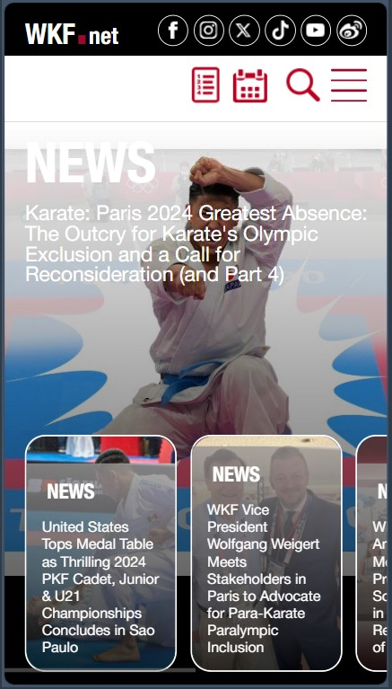
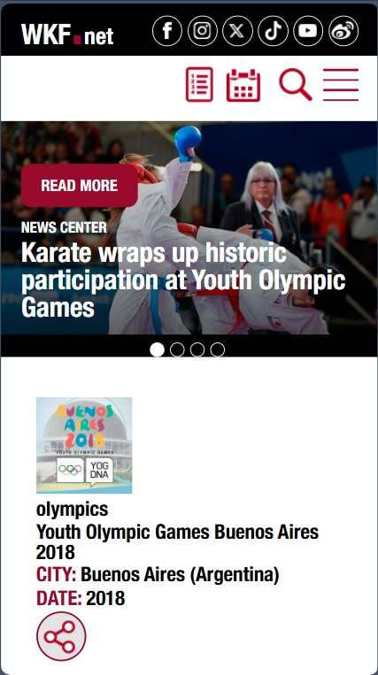
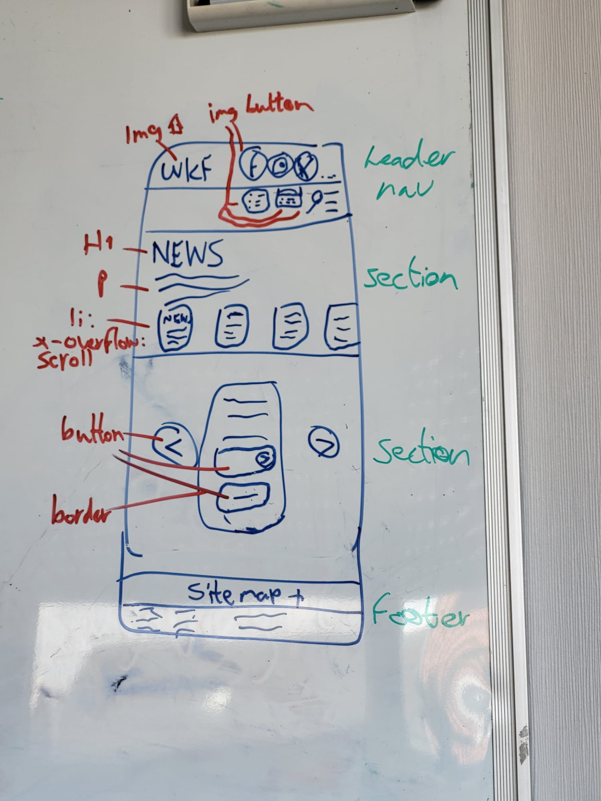
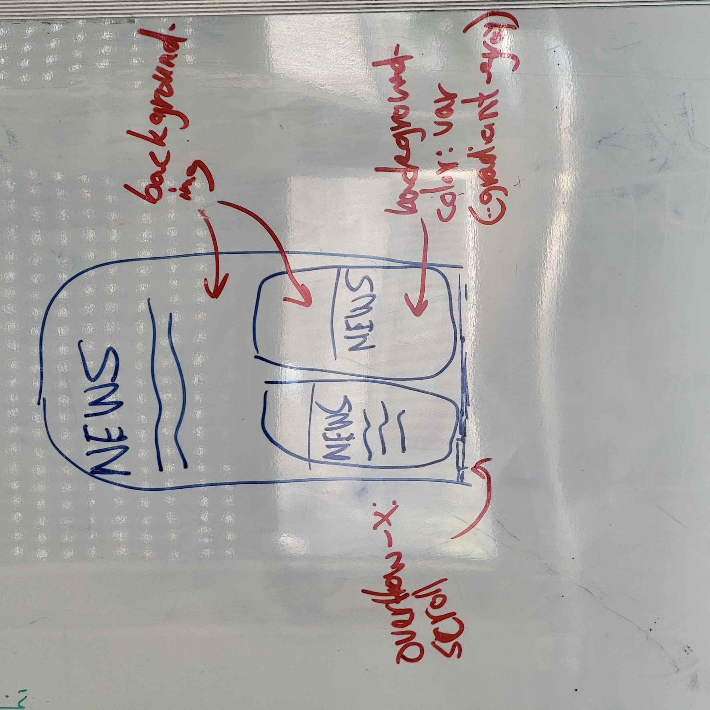
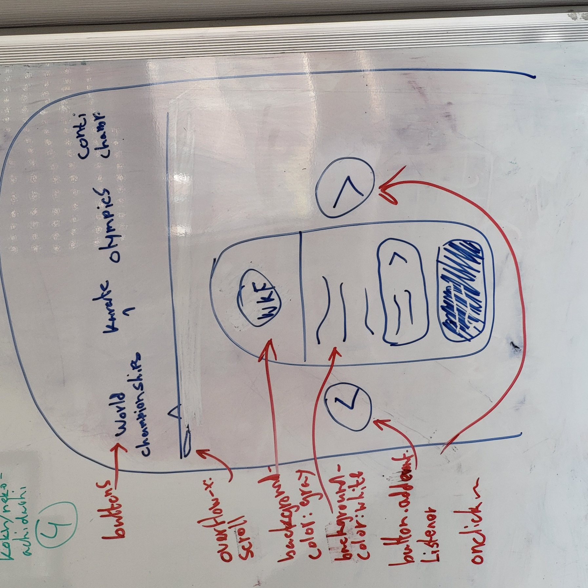

# Procesverslag
Markdown is een simpele manier om HTML te schrijven.  
Markdown cheat cheet: [Hulp bij het schrijven van Markdown](https://github.com/adam-p/markdown-here/wiki/Markdown-Cheatsheet).

Nb. De standaardstructuur en de spartaanse opmaak van de README.md zijn helemaal prima. Het gaat om de inhoud van je procesverslag. Besteedt de tijd voor pracht en praal aan je website.

Nb. Door *open* toe te voegen aan een *details* element kun je deze standaard open zetten. Fijn om dat steeds voor de relevante stuk(ken) te doen.

## Jij

  
uitwerken voor kick-off werkgroep

  ### Auteur:
  Nilesh Rampartaap
  #### Je startniveau:
  blauw 

  #### Je focus:
  surface plane 
 

## Je website

  
uitwerken voor kick-off werkgroep

  ### Je opdracht:
  https://www.wkf.net/ link naar de website die je gaat namaken óf de naam/omschrijving van je eigen ontwerp

  #### Screenshot(s) van de eerste pagina (small screen): 
  hier de naam van de pagina  
  

  #### Screenshot(s) van de tweede pagina (small screen):
  hier de naam van de pagina  
  
 

## Toegankelijkheidstest 1/2 (week 1)

  
uitwerken na test in 2e werkgroep

  ### Bevindingen
  Lijst met je bevindingen die in de test naar voren kwamen:

WAT NIET WAS AANGEVINKT IN DE CHECKLIST
  - De screenreader beschrijft de pagina niet goed genoeg, waardoor de gebruiker niet heel goed weet waar in de pagina die zich bevindt en/of welke informatie erbij wordt verteld.
  - Geen alt text voor de foto's en video's. Je hoort alleen "foto, foto" of "video, video"
  - de video's zijn niet afspeelbaar. Je ziet alleen een zwart scherm met een kruisje om de "video" weg te klikken.
  - De website heeft veel div elementen, waardoor je tags zoals <!--<button> en <h1>--> helemaal niet ziet. Daardoor ontbreken er zoveel tags
  - Er zijn onzichtbare elementen die gefocust kunnen worden met de tab toets.
  - De lay-out is redelijk simpel, maar omdat er zoveel elementen staan, is het toch nog een kleine chaos.
  - Je kan horizontaal scrollen in deze site, maar alleen voor specifieke content dat op een rijtje staat.
  
WAT WEL WAS AANGEVINKT IN DE CHECKLIST
  - De taal is straightforward, wat het makkelijker maakt om het te lezen.
  - Als de elementen die zichtbaar zijn in de focus state zijn, is het wel goed te zien dat ze in die state staan.
  - De video's spelen niet automatisch af.
  - Je kan je telefoon draaien en de content nog steeds goed lezen.
  - De contrast ziet er prima uit.

## Breakdownschets (week 1)

  
uitwerken na afloop 3e werkgroep

  ### de hele pagina: 
  

  ### dynamisch deel (bijv menu): nieuws stuk
  

  ### wellicht nog een dynamisch deel (bijv filter): hamburgermenu
  

## Voortgang 1 (week 2)

  
uitwerken voor 1e voortgang

  ### Stand van zaken
  hier dit ging goed & dit was lastig (neem ook screenshots op van delen van je website en code)

  ### Agenda voor meeting
  samen met je groepje opstellen

  | student 1      | student 2          | student 3    | student 4        |
  | ---            | ---                | ---          | ---              |
  | dit bespreken  | en dit             | en ik dit    | en dan ik dat    |
  | en dat ook nog | dit als er tijd is | nog een punt | dit wil ik zeker |
  | ...            | ...                | ...          | ...              |

  ### Verslag van meeting
  hier na afloop snel de uitkomsten van de meeting vastleggen

  - sommige buttons moesten a href zijn
  - het nieuws stukje is een section in zijn geheel, in het scroll gedeelte zit er een section en alle kleine blokjes zijn ook sections
  - voor een stukje van mijn website werden eerder sections aangeraden dan de details tag

## Voortgang 2 (week 3)

  
uitwerken voor 2e voortgang

  ### Stand van zaken
  hier dit ging goed & dit was lastig (neem ook screenshots op van delen van je website en code)

  ### Agenda voor meeting
  samen met je groepje opstellen

  | student 1      | student 2          | student 3    | student 4        |
  | ---            | ---                | ---          | ---              |
  | dit bespreken  | en dit             | en ik dit    | en dan ik dat    |
  | en dat ook nog | dit als er tijd is | nog een punt | dit wil ik zeker |
  | ...            | ...                | ...          | ...              |

  VRAGEN
  - Moet alles werken van de eventsections, of alleen om een keertje te laten zien? bijv. dat 1 knopje wel werkt en de rest niet, omdat het toch hetzelfde doet
  - Gebruiken van < en > als buttons lukt niet. Is daar een oplossing voor?
  - Moet alles er exact hetzelfde uitzien, of mag het een beetje afwijken? Ookal is dit niet perse iets wat bij ik over de surface plane over nagedacht heb.
  - de meeste elementen zijn niet te vinden op google, is het goed als ik images gebruik
  - Als er nog tijd over is: hamburgermenu?

  ### Verslag van meeting
  hier na afloop snel de uitkomsten van de meeting vastleggen

  - punt 1
  - punt 2
  - nog een punt
- ...

- hamburgermenu en dark mode is surface plane
- niet alles hoeft te werken, maar wel ong drie sections om te laten zien dat je het kan
- 

## Toegankelijkheidstest 2/2 (week 4)

  
uitwerken na test in 9e werkgroep

  ### Bevindingen
  Lijst met je bevindingen die in de test naar voren kwamen (geef ook aan wat er verbeterd is):

## Voortgang 3 (week 4)

  
uitwerken voor 3e voortgang

  ### Stand van zaken
  hier dit ging goed & dit was lastig (neem ook screenshots op van delen van je website en code)

  ### Agenda voor meeting
  samen met je groepje opstellen

  | student 1      | student 2          | student 3    | student 4        |
  | ---            | ---                | ---          | ---              |
  | dit bespreken  | en dit             | en ik dit    | en dan ik dat    |
  | en dat ook nog | dit als er tijd is | nog een punt | dit wil ik zeker |
  | ...            | ...                | ...          | ...              |

  ### Verslag van meeting
  hier na afloop snel de uitkomsten van de meeting vastleggen

  - punt 1
  - punt 2
  - nog een punt
  - ...

## Eindgesprek (week 5)

  
uitwerken voor eindgesprek

  ### Je uitkomst - karakteristiek screenshots:
  

  ### Dit ging goed/Heb ik geleerd: 
  Korte omschrijving met plaatjes

  

  ### Dit was lastig/Is niet gelukt:
  Korte omschrijving met plaatjes

  

## Bronnenlijst

  
continu bijhouden terwijl je werkt

  Nb. Wees specifiek ('css-tricks' als bron is bijv. niet specifiek genoeg). 
  Nb. ChatGpT en andere AI horen er ook bij.
  Nb. Vermeld de bronnen ook in je code.

  1. bron 1
  2. bron 2
  3. ...

